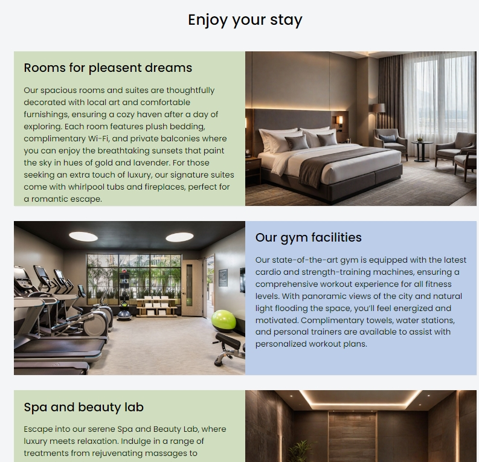
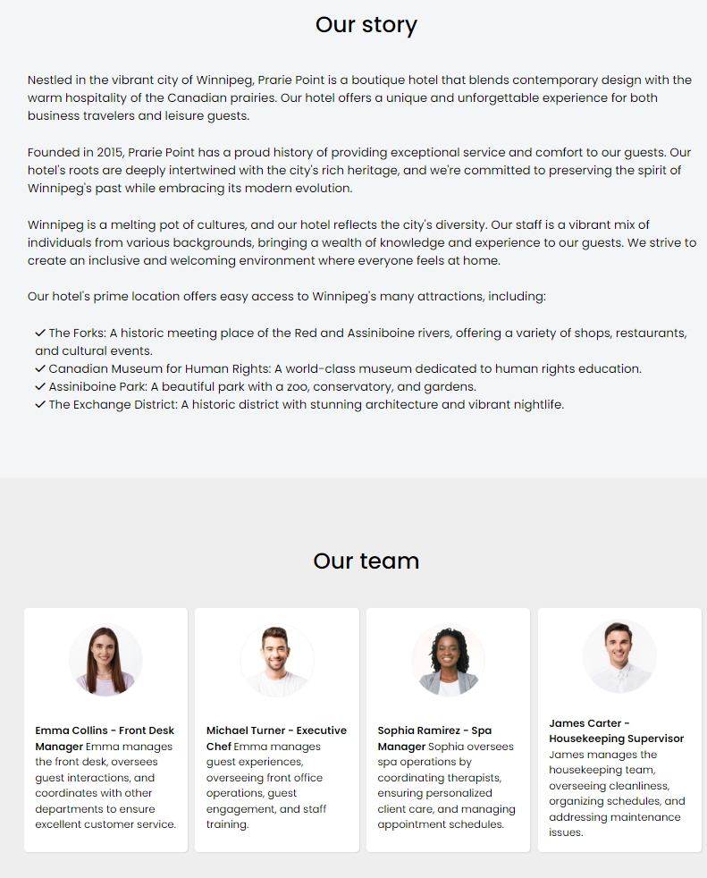

# Praire Point Hotel Website

### Project description
This project is a simple front-end website for the hotel showcasing
available facilities like state of art swimming pool, spacious and thoughtfully 
decorated rooms, gym facilities, spa and beauty lab, and enticing food and 
beverage from the on-site restaurants and bars. The website has a banner section 
on the page with a call to action to make hotel reservation bookings. The home
page also featured a section where the hotel facilities were described. We also
a four column gallery section for the pictures of these facilities.

The about us page describes the hotel rich history and also the 
background 

### Preview photos 

#### Hotel facilities

 
#### Our story and our team

### Description of project features
The website is designed with HTML5 and CSS. The website is designed to be fully
responsive using CSS media queries to adapt to different screen sizes. The 
website also features a clear and descriptive navigation menu to guides users 
through the different pages of the website.

### Technologies used 
* HTML 5 
* CSS 